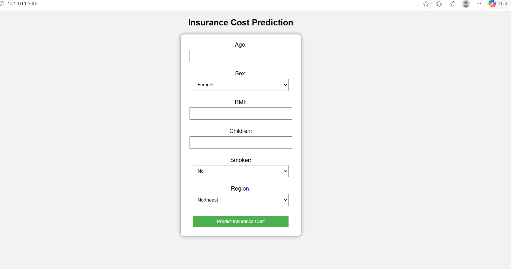

# Insurance Cost Prediction Web App

This project predicts medical insurance costs using Machine Learning and Flask.

## Technologies Used
- Python
- Scikit-Learn
- XGBoost
- Flask
- HTML

## Features
- User inputs health data
- Machine learning model predicts insurance charges
- Web interface using Flask

## Input Features
- Age
- Sex
- BMI
- Children
- Smoker
- Region

## Model
XGBoost Regressor with R² score ≈ 0.86

## How to Run

1. Install dependencies

pip install -r requirements.txt

2. Run the app

python app.py

3. Open browser

http://127.0.0.1:5000

## Live Demo

https://insurance-cost-prediction-03c8.onrender.com

## Application Preview

